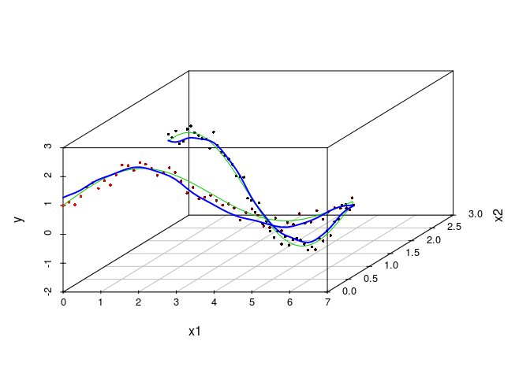

BackFitting Algorithm
=====================

In this file, I am trying to show how we can fit a funtion to a model by using BackFitting algorithm. This file is part of my project for Advanced Data Mining course with Prof. Culp.

``` r
#############
### Fitting gam simulation example
#############
library(MASS)
library(cluster)
library(scatterplot3d)
####
## Generate data
####
set.seed(10)
n=100
x1<-c(seq(0,2*pi,length=n/2),seq(2*pi,0,length=n/2))
x2<-c(seq(0,sqrt(2*pi),length=n))
x=cbind(x1,x2)
h<-function(x,y){
  sin(x)+cos(y^2)
}
y<-h(x1,x2)+rnorm(n,0,0.2)

#####
## Plot 3d
#####
g1<-scatterplot3d(x1,x2,y,highlight.3d=TRUE,cex.symbols=.5,pch=16)

####
## Draw function on 3d plot
###
zs<-g1$xyz.convert(x1,x2,h(x1,x2))
lines(zs$x,zs$y,col=3,lwd=1)

####
## Set-up matrices
####
W1=exp(-as.matrix(daisy(as.matrix(x1)))^2/0.075)
W2=exp(-as.matrix(daisy(as.matrix(x2)))^2/0.075)
Del1=diag(apply(W1,1,sum))-W1
Del2=diag(apply(W2,1,sum))-W2
W=(W1+W2)/2

f1=rep(0,n)
f2=rep(0,n)
alp=0
ones=rep(1,n)


#####
## Employ backfitting
####

f1=rep(0,n)
f2=rep(0,n)
alp=0
ones=rep(1,n)
for (m in 1:1000){
  alp = (1/(t(ones)%*%W%*%ones))*(t(ones)%*%W%*%(y-f1-f2))
  f1 = ginv(Del1+W)%*%W%*%(y-alp*ones-f2)
  f2 = ginv(Del2+W)%*%W%*%(y-alp*ones-f1)
}

####
## Plot additive model
####
eta=as.vector(alp*ones+f1+f2)
zs0<-g1$xyz.convert(x1,x2,eta)
lines(zs0$x,zs0$y,col=4,lwd=2)
```


